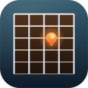

<div align="center">



# Fretboard Trainer

**A chromatic tuner and ear-training game for macOS.**

Plug in your guitar (or any monophonic instrument), and either tune up or run timed drills where the app randomly throws notes at you and times how fast you can play them.

[](https://github.com/dasaro/FretboardTrainer/releases/latest)
[](https://www.apple.com/macos/)
[](LICENSE)

</div>

---

## Features

- **Tuner mode** — real-time pitch detection with cents-accurate tuning meter (50–2000 Hz range, ±1¢ resolution on a clean signal).
- **Fretboard Trainer mode** — random pitch-class drills with selectable session lengths (1 / 3 / 5 / 10 min). The app waits for you to play the correct note, then advances. Wrong notes are simply ignored — no penalty, just play until you nail it.
- **Performance metrics** — live countdown, notes hit, average time per note, and notes-per-minute (NPM). Best NPM per session length is saved across launches.
- **Input device picker** — selectable input device with hot-swap. Works with built-in microphones, USB audio interfaces, and aggregate devices.
- **YIN-based pitch detection** — 8192-sample analysis window with parabolic interpolation and clarity-based confidence gating. Monophonic only.

## Requirements

- macOS 14 (Sonoma) or later
- Apple Silicon (arm64)
- A microphone or audio input device

## Installation

### Step 1 — Download and move to Applications

1. Download **FretboardTrainer-x.y.z-arm64.zip** from the [Releases page](https://github.com/dasaro/FretboardTrainer/releases/latest).
2. Unzip it.
3. Drag **FretboardTrainer.app** into your **/Applications** folder.

### Step 2 — Open it the first time

> **You will hit a Gatekeeper warning. This is normal, and there are two clicks to get past it.** It happens because the app is signed locally rather than by Apple ($99/yr Developer Program); the code is the same code you can read in the repository.

**The two-click way (recommended):**

1. Open **/Applications** in Finder.
2. **Right-click** (or hold Control and click) **FretboardTrainer.app** → choose **Open**.
3. A dialog says it's from an unidentified developer. Click **Open** anyway.
4. macOS will remember your decision — double-clicking works normally from now on.

**The Terminal way (if the right-click flow doesn't show "Open"):**

```sh
xattr -d com.apple.quarantine /Applications/FretboardTrainer.app
open /Applications/FretboardTrainer.app
```

This strips the quarantine flag macOS attached to the downloaded file.

### Step 3 — Grant microphone access

On the first launch, macOS will prompt for microphone access. Click **OK** — the app cannot detect notes without it. If you accidentally clicked **Don't Allow**, the app will show a red banner with an *Open Settings* button that takes you straight to the right panel.

## Usage

### Tuner mode

1. Click **Start Listening**.
2. Pick your input device from the dropdown if needed.
3. Play a note. The detected pitch, frequency in Hz, and a ±50 cents tuning meter appear. The meter dot is **green** within ±5¢, **yellow** within ±15¢, and **red** beyond.

### Fretboard Trainer mode

1. Switch the mode picker to **Fretboard Trainer**.
2. Click **Start Listening** if you haven't already.
3. Pick a session length: **1**, **3**, **5**, or **10 min**.
4. Click **Start Session**.
5. A random pitch class (C, C#, …, B) appears. Play it on any string in any octave — when the app hears it, you advance to the next.
6. After the timer runs out, you'll see your **notes per minute**, total notes, and average time. If you beat your previous best for that session length, a **NEW BEST** badge appears.

> Tip: the app gives you the benefit of the doubt. If you fumble or hit a wrong note while reaching for the target, it's silently ignored. Only the moment you play the correct pitch class counts.

### Keyboard shortcuts

| Key | Action |
|-----|--------|
| `⌘1` / `⌘2` / `⌘3` / `⌘4` | Switch to Tuner / Trainer / Find the Note / History |
| `⌘N` | New Session |
| `⌘.` | Stop Session |
| `⌘→` | Skip current note |
| `⌘L` or `Space` | Toggle Listening |
| `⌘,` | Settings |
| `⇧⌘⌫` | Reset Session History |
| `⇧⌘/` | Show keyboard shortcuts |
| `A`–`G` | Play natural note (in Find the Note, letter step) |
| `⇧A`–`⇧G` | Play sharp note (`⇧C` = C#, etc.) |

The same list is available in the app via **Help → Keyboard Shortcuts**.

## Troubleshooting

**No input devices in the dropdown** — click the refresh button next to the picker. If your interface still doesn't appear, check **System Settings → Privacy & Security → Microphone** and ensure FretboardTrainer is allowed.

**Pitch detection is unreliable** — the detector is monophonic. Single notes work cleanly; chords, palm-muted notes, and very low/quiet notes are harder. Make sure your signal level fills the meter at least halfway when you play.

**App won't launch** — re-run the `xattr` command above, or right-click → Open from Finder. If you've already moved the app and granted Gatekeeper approval, normal double-click should work.

## Changelog

See [CHANGELOG.md](CHANGELOG.md) for the full release history.

## License

[MIT](LICENSE) © 2026 dasaro
