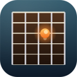

<div align="center">



# Fretboard Trainer

**A chromatic tuner and ear/fretboard-training game for macOS.**

Plug in your guitar (or any monophonic instrument) and either tune up or run timed drills that train note recognition, intervals, scale degrees, chords, string-skipping, and the circle of fifths — the app listens to what you play and times how fast you find each target.

[](https://github.com/dasaro/FretboardTrainer/releases/latest)
[](https://www.apple.com/macos/)
[](LICENSE)

</div>

---

## Features

### Tuner
- **Real-time pitch detection** with a cents-accurate tuning meter (±1¢ resolution on a clean signal). The meter dot is **green** within ±5¢, **yellow** within ±15¢, **red** beyond.

### Practice modes
Every practice mode runs as a timed session (1 / 3 / 5 / 10 min) and reports notes hit, wrong notes, average time per note, and notes-per-minute (NPM). Best NPM per session length and training type is saved across launches.

- **Trainer** — a random pitch class (C, C#, …, B) appears; play it on any string in any octave. Targets are shown as either spelling (e.g. "C#" or "Db") and either is accepted.
- **Find the Note** — a fretboard position is shown; play it. An optional naming step then asks you to click/type the letter to reinforce recall.
- **Intervals** — play the named interval above a root. An optional extended mode walks root → interval → name, with a confirmation cue the moment the root lands.
- **Scale Degrees** — play a scale degree (2–7, major and/or minor) above a tonic, with the same optional play-tonic-then-name flow.
- **Circle of 5ths** — active-recall practice of the circle: a key is shown and you retrieve and play the next position from memory — a fifth up (clockwise), a fourth up (counter-clockwise), or the relative minor. Random order by default (maximum retrieval); an optional ordered cycle (C → G → D → …) drills the sequence. Keys are spelled conventionally — Bb, Eb, Ab, Db, Gb on the flat side.
- **Chord Builder** — find a seed note on a string, then build a triad or 7th chord *around* it, playing the remaining tones anywhere on the neck. Toggles: find-on-a-string first, let the anchor be any chord tone (so you work out the root), and name the notes at the end (each tone as you go, or all together).
- **Note on String** — find a target note on a specific string, with an open-string verification step. Can be locked to a single string for focused drilling.
- **Open Strings** — a pure string-skipping speed drill. One open string (E A D G B E) is named at a time; pluck it as fast as you can. Octave-aware, so a "high E" prompt isn't satisfied by ringing the low E.

### Across all modes
- **Adaptive note selection (opt-in)** — Settings → Practice. Biases random selection toward the notes/intervals/strings you're slowest at, using the SM-2 spaced-repetition algorithm. Each exercise keeps its own per-training-type difficulty map. Off by default (uniform random).
- **Show detected note (opt-in)** — a small "Heard: X" line under the prompt, tinted on a **green→red gradient** by how far the detected pitch is from the target, so you can see *how* off you are at a glance.
- **Wrong-note counting** — each session tallies wrong notes uniformly across every mode, with onset gating and decay suppression so sustained ring-out and low-level noise don't get charged as mistakes.
- **History — Progress & Mastery.** *Progress* charts your trend over time (notes-per-minute plus four other metrics, against Date or Session #), with Adaptive and Uniform sessions distinguished by colour and shape. *Mastery* breaks each exercise down to the specific thing it trains — the interval, chord tone, scale degree, string, or circle relationship — as a weakest-first table with recent average time, miss rate, attempt count, and an improving/worsening trend arrow. Two questions, two views: *am I improving?* and *what am I weakest at right now?* (The Trainer even distinguishes enharmonic spellings — is "Eb" slower for you than "D#"?)
- **Input device picker** with hot-swap — built-in mics, USB interfaces, and aggregate devices.
- **YIN-based pitch detection** — 8192-sample analysis window with parabolic interpolation and envelope-based onset detection. Monophonic only.

### Experimental
- **Chord ID** (in the **View** menu, not the main picker) — a live readout that names the major/minor triad you're holding, via frequency-domain chroma analysis with harmonic suppression. Separate from the monophonic detector the exercises use; best on a clean DI signal. A confidence and "3rd-strength" meter flags the classic single-note-overtone false positive (a lone note's overtones spell its own major triad).

## Requirements

- macOS 14 (Sonoma) or later
- Apple Silicon (arm64)
- A microphone or audio input device

## Installation

### Step 1 — Download and move to Applications

1. Download **FretboardTrainer-x.y.z-arm64.zip** from the [Releases page](https://github.com/dasaro/FretboardTrainer/releases/latest).
2. Unzip it.
3. Drag **FretboardTrainer.app** into your **/Applications** folder.

### Step 2 — Open it the first time

> **You will hit a Gatekeeper warning. This is normal, and there are two clicks to get past it.** It happens because the app is signed locally rather than by Apple ($99/yr Developer Program); the code is the same code you can read in the repository.

**The two-click way (recommended):**

1. Open **/Applications** in Finder.
2. **Right-click** (or hold Control and click) **FretboardTrainer.app** → choose **Open**.
3. A dialog says it's from an unidentified developer. Click **Open** anyway.
4. macOS will remember your decision — double-clicking works normally from now on.

**The Terminal way (if the right-click flow doesn't show "Open"):**

```sh
xattr -d com.apple.quarantine /Applications/FretboardTrainer.app
open /Applications/FretboardTrainer.app
```

This strips the quarantine flag macOS attached to the downloaded file.

### Step 3 — Grant microphone access

On the first launch, macOS will prompt for microphone access. Click **OK** — the app cannot detect notes without it. If you accidentally clicked **Don't Allow**, the app will show a red banner with an *Open Settings* button that takes you straight to the right panel.

## Usage

### Tuner

1. Click **Start Listening**.
2. Pick your input device from the dropdown if needed.
3. Play a note. The detected pitch, frequency in Hz, and a ±50 cents tuning meter appear.

### Practice sessions

1. Pick a mode from the segmented control (Trainer, Find the Note, Intervals, Scale Degrees, Circle of 5ths, Chord Builder, Note on String, Open Strings).
2. Click **Start Listening** if you haven't already.
3. Choose a session length (**1 / 3 / 5 / 10 min**) and, optionally, a training-type label so history groups related sessions together.
4. Click **Start Session** and play each target as it appears. When the app hears the right note, you advance.
5. When the timer ends you'll see your **notes per minute**, total notes, wrong notes, and average time. Beat your previous best for that mode + length and a **NEW BEST** badge appears.

> Tip: the app gives you the benefit of the doubt. Fumbles and stray notes while reaching for the target are ignored — only playing the correct pitch advances you. Wrong notes are still *counted* (after a real pluck), but never block progress.

### Keyboard shortcuts

| Key | Action |
|-----|--------|
| `⌘1` … `⌘0` | Switch mode: Tuner / Trainer / Find the Note / Intervals / Scale Degrees / Circle of 5ths / Chord Builder / Note on String / Open Strings / History (`⌘0`) |
| `⌘N` | New Session |
| `⌘.` | Stop Session |
| `⌘→` | Skip current note |
| `⌘L` or `Space` | Toggle Listening |
| `⌘,` | Settings |
| `⇧⌘⌫` | Reset Session History |
| `⇧⌘/` | Show keyboard shortcuts |
| `A`–`G` | Play natural note (in letter-naming steps) |
| `⇧A`–`⇧G` | Play sharp note (`⇧C` = C#, etc.) |

The experimental **Chord ID** mode has no accelerator — open it from the **View** menu.

The same list is available in the app via **Help → Keyboard Shortcuts**.

## Troubleshooting

**No input devices in the dropdown** — click the refresh button next to the picker. If your interface still doesn't appear, check **System Settings → Privacy & Security → Microphone** and ensure FretboardTrainer is allowed.

**Pitch detection is unreliable** — the detector is monophonic. Single notes work cleanly; chords, palm-muted notes, and very low/quiet notes are harder. Make sure your signal level fills the meter at least halfway when you play.

**App won't launch** — re-run the `xattr` command above, or right-click → Open from Finder. If you've already moved the app and granted Gatekeeper approval, normal double-click should work.

## Changelog

See [CHANGELOG.md](CHANGELOG.md) for the full release history.

## License

[MIT](LICENSE) © 2026 dasaro
